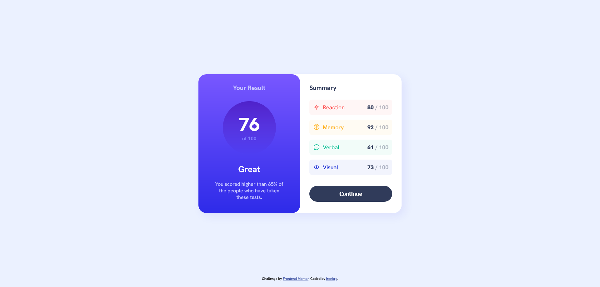

# Frontend Mentor - Results summary component solution

This is a solution to the [Results summary component challenge on Frontend Mentor](https://www.frontendmentor.io/challenges/results-summary-component-CE_K6s0maV). Frontend Mentor challenges help you improve your coding skills by building realistic projects. 

## Table of contents

- [Overview](#overview)
  - [The challenge](#the-challenge)
  - [Screenshot](#screenshot)
  - [Links](#links)
- [My process](#my-process)
  - [Built with](#built-with)
  - [What I learned](#what-i-learned)

## Overview

### The challenge

Users should be able to:

- View the optimal layout for the interface depending on their device's screen size
- See hover and focus states for all interactive elements on the page

### Screenshot



### Links

- Solution URL: 
- Live Site URL: https://jrdnbrg.github.io/results-summary-component/

## My process

### Built with

- Semantic HTML5 markup
- Flexbox

### What I learned

Through this project I learned about gradients in CSS. This is the new syntax I learned:  
```css
.result-section {
    background-image: linear-gradient(hsl(252, 100%, 67%), hsl(241, 81%, 54%));
  }
```